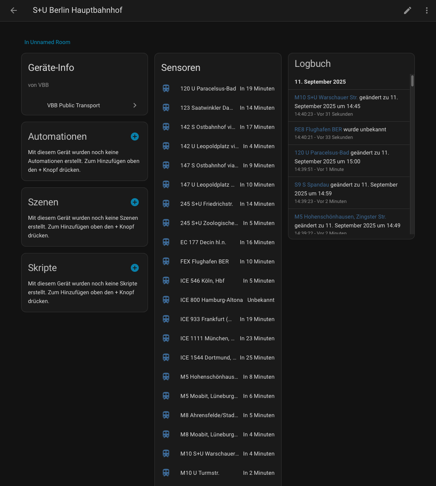

# HA Public Transport VBB

Ce dépôt fournit une intégration Home Assistant permettant d'obtenir les horaires de départ du réseau de transport public de Berlin-Brandebourg (VBB) et de les exposer sous forme de capteurs. Chaque arrêt configuré apparaît dans Home Assistant comme un appareil distinct.

## Exemple

## Installation

L'intégration est disponible en tant que [dépôt par défaut dans HACS](https://hacs.xyz/) :

1. Ouvrez **HACS → Intégrations** et recherchez **VBB Public Transport**.
2. Installez l'intégration puis redémarrez Home Assistant.

Sinon, copiez le dossier `custom_components/vbb` dans votre répertoire `custom_components`.

## Configuration

Après l'installation l'intégration peut être configurée via l'interface utilisateur :

1. Allez dans **Paramètres → Appareils et services → Ajouter une intégration**.
2. Choisissez **VBB Public Transport**.
3. Recherchez un arrêt en saisissant son nom ou ses coordonnées et sélectionnez le résultat souhaité.
4. Définissez le nom, la période de requête (`duration` en minutes) et le nombre maximal de résultats (`results`).

### ID d'arrêt (optionnel)

L'intégration inclut une fonction de recherche, il n'est donc plus nécessaire de saisir manuellement l'ID d'arrêt. Il est toujours possible de l'obtenir via l'API publique : `https://v5.vbb.transport.rest/locations?query=<nom de l'arrêt>` (ex. `https://v5.vbb.transport.rest/locations?query=Berlin%20Hauptbahnhof`). L'ID d'arrêt se trouve dans le champ `id` de la réponse JSON.

Pour chaque ligne et direction à l'arrêt un capteur séparé est créé (par ex. `S7 S Strausberg`). L'état du capteur indique le prochain départ. Le retard actuel en minutes est exposé dans l'attribut `delay`. Les autres départs sont disponibles dans l'attribut `departures`. Des informations supplémentaires comme `latitude`, `longitude`, `station_dhid`, `line_id`, `operator` et `trip_id` sont fournies.

## Remarques

L'intégration utilise l'API publique `https://v5.vbb.transport.rest/`. Une connexion Internet active est nécessaire. La couverture du service est limitée aux arrêts situés en Allemagne (zone VBB). Home Assistant 2023.12 ou version ultérieure est requis.

Par défaut les départs des 120 prochaines minutes et jusqu'à 100 résultats sont interrogés. Ces valeurs peuvent être ajustées dans la configuration.

## Auteur

Ce dépôt a été créé par [404GamerNotFound](https://github.com/404GamerNotFound) (Tony Brüser).
